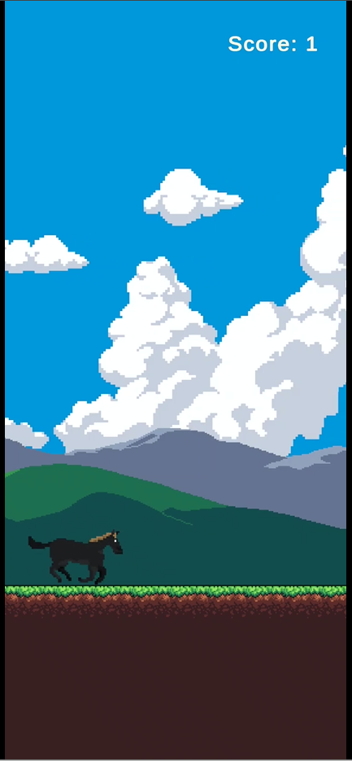
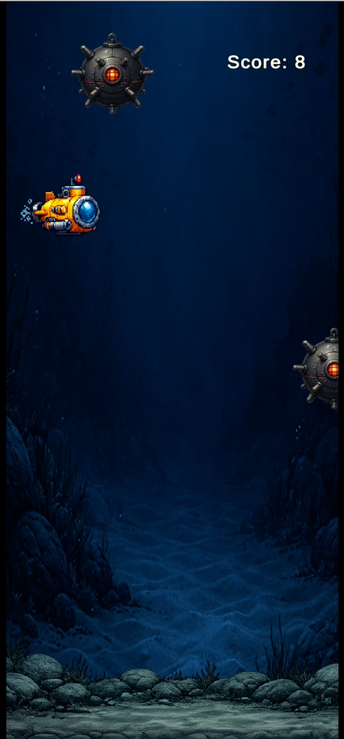
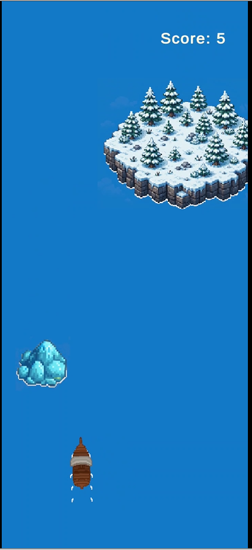
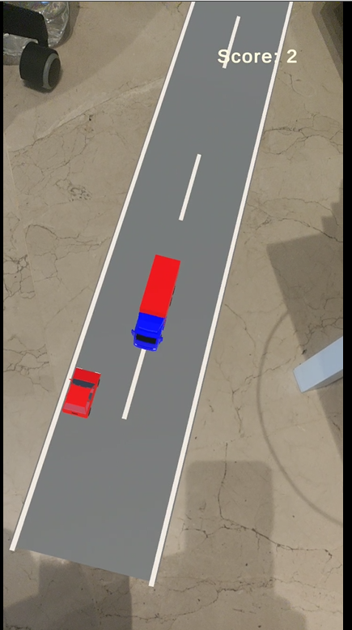
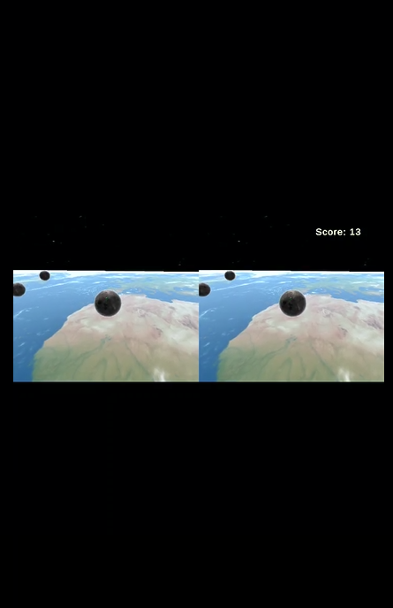

# Unity AR/VR Minigame Platform

A Unity-based collection of interactive minigames developed as a collaborative academic project.

The platform contains:

## Included Minigames

### 2D Games
- Horse Runner
- Boat Survival
- Submarine Escape

### AR Experience
- AR Racing Game

### VR Experience
- Space Survival VR

## Features

- Campaign mode connecting all games
- Individual game selection
- Persistent scoring system
- Scene flow management
- UI menus and transitions
- VR interaction system
- AR gameplay mechanics

## Technologies

- Unity
- C#
- Google Cardboard VR
- AR Foundation
- Git / GitHub

## My Contributions

Main responsibilities included:

- Gameplay programming in C#
- Score system implementation
- Menu and scene flow logic
- VR mechanics and interaction
- Game balancing and bug fixing
- UI integration

## How to Run

1. Clone the repository
2. Open with Unity Hub
3. Open the main menu scene
4. Press Play

## Screenshots

### Horse Runner (2D)

### Submarine Escape (2D)

### Boat Survival (2D)

### AR Racing

### VR Space Survival
